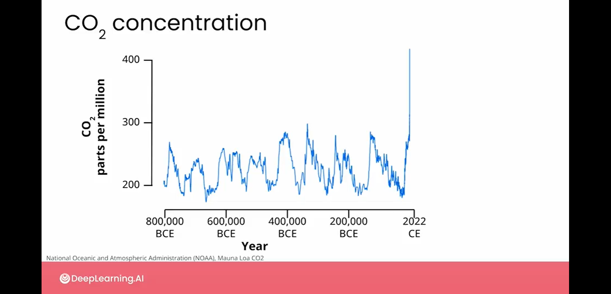

# welcome
-  In this course, you see how AI can be part of the solution for challenges that we face with climate change.
- In this course you work through case studies and see how teams around the world are approaching the problems presented by climate change.
- You see where AI can be applied to applications and renewable energy and biodiversity monitoring.
- How can AI be applied:
    - power forecasting: How much solar, how much wind they decide to ramp up or down high polluting plants and just optimize the power grid?
    - conditions forecasting: We don't always know how sunny is going to be or what the wind is going to be like.
- Course use cases:
    - Wind power forecasting
        - The power grids built on fossil fuels will often only have a variance of a couple of percent, any higher or lower and then people start getting in blackouts or brownouts. We're really rethinking what power grids look like when we can have distributed power from people's batteries in their homes or in their cars. Power that can be shared across multiple grids based on what renewable energies were able to produce power a lot of times.
    - Biodiversity monitoring
        - We are looking at images from a national park in South Africa trying to gauge the number of animals. This can tell us what is the environmental impact or the other human impacts which are reducing the number of animals in a given location.

# Climate Change
- Unfortunately, climate change is already impacting human populations and natural ecosystems through droughts, floods, wildfires, rising sea levels, and other adverse phenomenon.
- Climate change is a global phenomenon: climate change impacts populations and ecosystems around the world.
- The effects of climate change are wide ranging and might include seemingly contradictory phenomena like extreme drought in one location and heavy flooding in another.
- Underneath it all, however, the one thing driving all the manifestations of climate change is the fact that global temperatures are on the rise on average year after year.
    - 
    - 0.0 - 50-year average, leading up to the 20th century
    - red/blue bars - annual average relative to the 0.0 point, red warmer, blue colder
    - now, it is 1.1 warmer than 100 years ago
        - 
- Impact of 1.1C warming: extreme weather, dangerous heat waves, melting glaciers and polarized caps, which in turn is leading to sea level rises and so on.
- Why?
    - Sometime in the early 20th century humans started consuming more energy year after year and that energy has mostly come from fossil fuels.
        - 
    - These are fuels like coal, oil, and gas. What you can see clearly from this plot is that the consumption of fossil fuels has increased dramatically since mid of 20th-century.
    - The reason all this fossil fuel consumption is concerning, is that burning fossil fuels releases gases into the atmosphere, gases like carbon dioxide, carbon monoxide, and methane.
    - All these gases contribute to an increase in greenhouse effect in the atmosphere of the Earth.
        - 
    - The way this works is that when sunlight comes down and warms the Earth, the Earth radiates that heat away towards space. With increased greenhouse gases in the atmosphere, more of the heat gets trapped and the atmosphere, warms up as a result.
    - As a result, we see annual global average temperatures, that a higher now by about one-degree Celsius.
- Where are we relative to "normal"? - CO2
    - 
    - 
    - This means that each year we capture even more of the sun's energy.
    - That energy will go into a global temperature rise that will be greater on average in years to come than it has been in the past.
