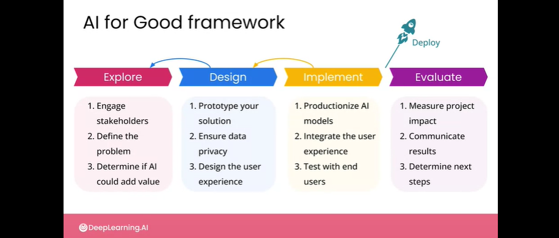
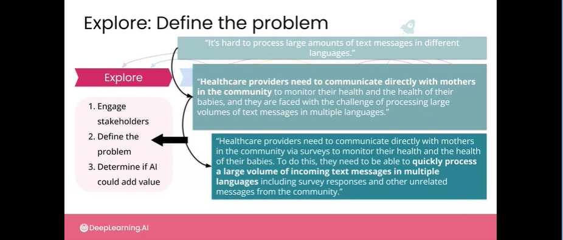
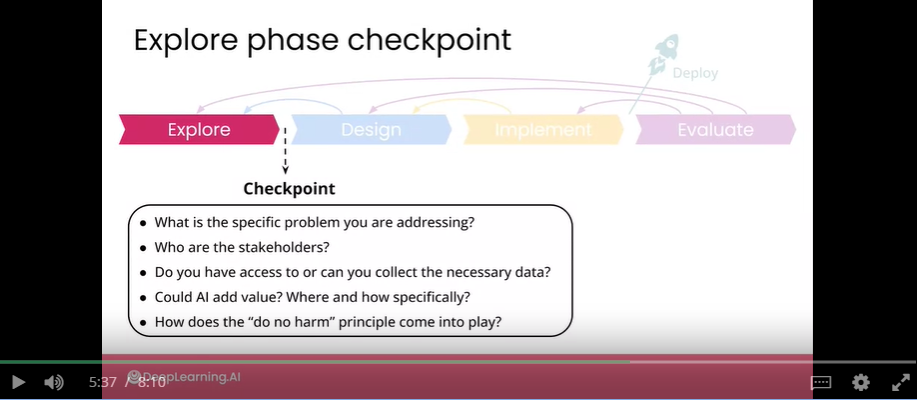
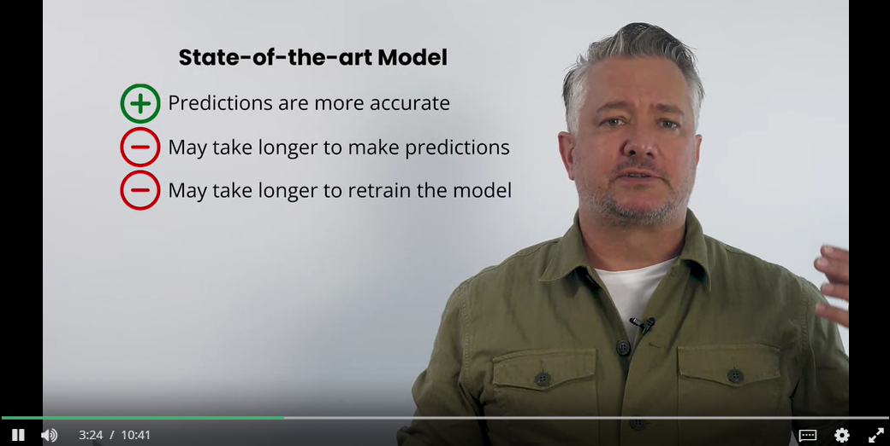
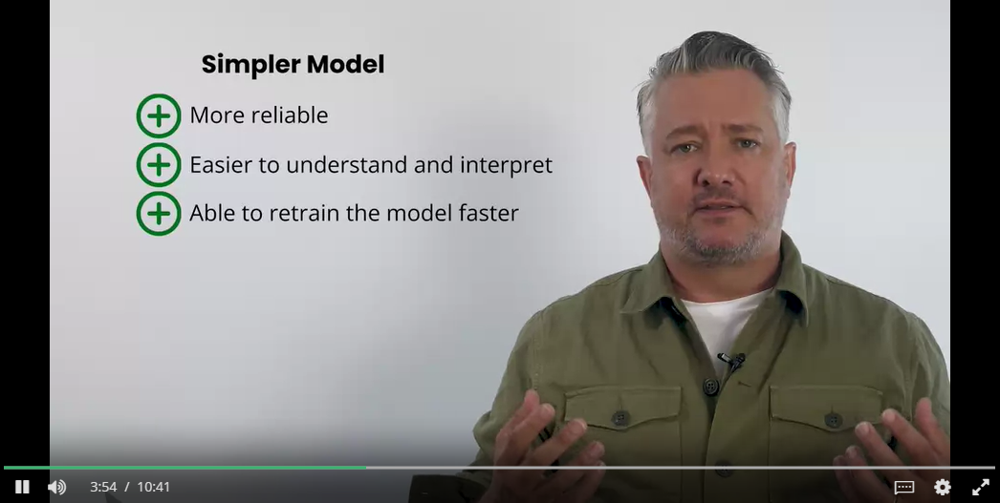
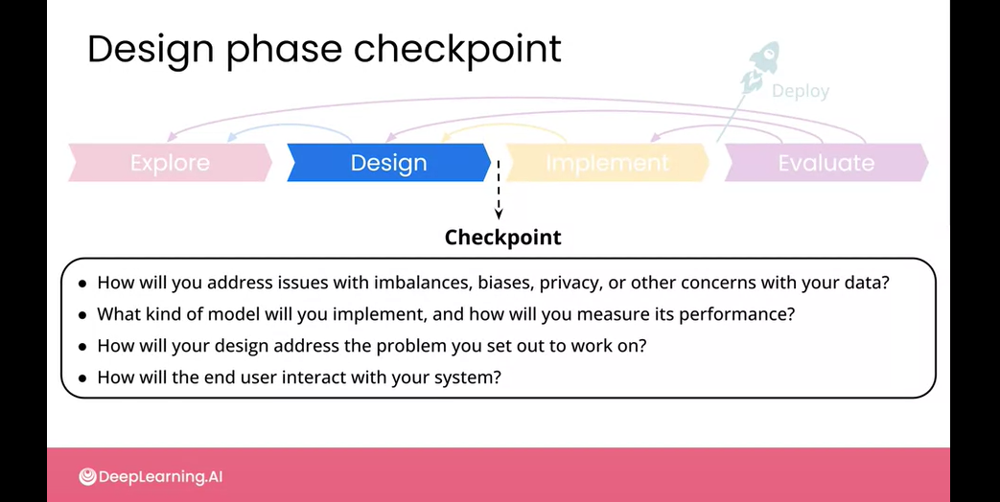
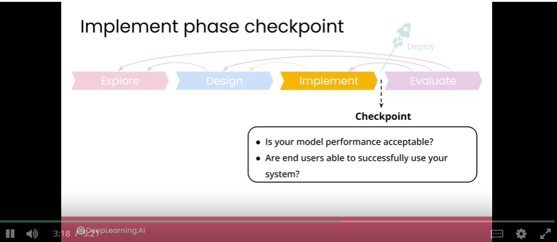

# The framework
- In the second week of the course, you'll now be walking through a framework for structuring your approach to AI for good projects.
    - In fact, this is a framework that you could apply to any project where AI could be a part of the solution
- This framework might seem like a waterfall development paradigm. But knowing where you add in terms of evaluating your project impact could equally apply to agile development paradigms with more frequent iterations.

# Framework phases
1. Explore
    - engage stakeholders
    - define the problem
    - determine if AI could add value
    - Make sure exploration of the project looks promising :)
2. Design
    - prototype your solution, developing your model strategy, investigating the data
    - ensure data privacy
    - design the user experience
    - it is possible that within design phase some assumptions from explore phase are false!
        - if so: go back to explore phase
        - it is ok that this is an iterative process
3. Implement
    - productionize AI models - take what you have designed and get it ready for deployment
    - integrate the user experience
    - test with end users
    - it is possible that some aspects of design wouldnt work out - you just go back to design phase, its ok to get back
4. Deploy!
    - lots of aspects there
5. Evaluate
    - measure project impact
    - communicate results
    - determine next steps
- 

# Explore phase

## problem definition
- A good problem statement should:
    - define the problem you are hoping to address: be clear, concise, and specific
    - identify key stakeholders
    - give an idea of what success looks like
    - not necessarily mention the specific technology you aim to deploy
- GOOD/BAD Examples:
    - 

## stakeholders engagement
- project example:
    - stakeholders are UNICEF, Clinic staff, Community members

## can AI even add value?
- Think about whether the effort, time, and expertise needed to implement an AI solution seems worth it for this particular use case
- The question of whether AI can add value or not to any particular solution will depend on the kind of data you have access to and the problem that you were trying to address.
- At this stage, it's important to think about the do-no-harm principle and consider any negative impacts that your work might have. It may not always be obvious, especially at the start, how your work could end up doing harm. But if you are considering the potential negative outcomes at every phase of your project development and working with your stakeholders on those, then you'll be more likely to avoid those negative outcomes.
    - Example: message contain personally identifiable information that should be kept private and secure
    - Example: Some responses / predictions are not accurate - might do harm!
    - Talking to stakeholders in order to understand all the possible harm - a good idea

## End of explore phase
- Do a checkpoint and ask yourself quetions:
    - 
- Expected result of Exploration phase:
    - you've identified and communicated with the stakeholders
    - you've got all the information that you needed to clearly define the problem that you aim to work on
    - you've determined that AI can most likely add value in this particular scenario.

# Design phase
- Things to do in this phase:
    - look at your data and design your model strategy and your annotation strategy
    - figure out how you're going to do a data privacy and security
    - plan your user experience
- You should be ensuring both the privacy, the security, and the dignity of the people whose data you're storing.
    - whenever you're dealing with data that includes information about people or property, you have to be very deliberate about how you're going to handle that data at all stages of your project in order to ensure that it remains secure and private. 
    - you should not use any personal data without explicit permission for your specific use case.
    - you should be defaulting to private data practices in all of these cases. 
- State-of-the-art model VS much simpler model
    - 
    - 

## Checkpoint!
- Ask yourself questions at the end of phase BEFORE moving on to development:
    - 

# Implement phase
- In this phase, you'll get ready for production by running any final training and testing of your model and moving it into a scalable production environment.
- We will be concerned with monitoring your model performance and understanding potential failure modes, among other things
- End-to-end testing: Look at everything in your system from one end to another in terms of data throughput, model monitoring and reliability systems, updates and user experience. 

## Checkpoint!
- 

# Evaluate phase
- At the end, you should still be able to evaluate your project in terms of the problem definition that you had initially set out to do.
- This is the evaluation of your results and the user experience of the people who are using and getting a benefit from the system that you've created.
