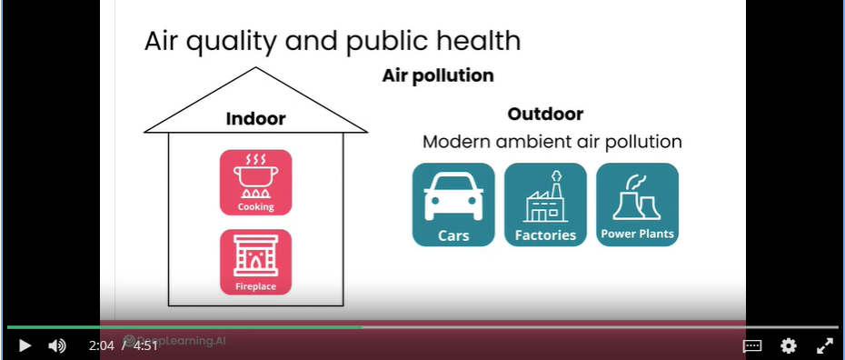

# Project: Air Quality
- You'll dive into the case study: estimating pollution levels throughout the city of Bogota
    - Pollution is a major public health issue and millions of people die each year due to prolonged exposure to polluted air. 
    - We are going to be looking at estimated air pollution in Bogota, Columbia for citizens and public health professionals.
    - While we are looking at Bogota, Columbia, this is a problem that people all around the world are working on. And you could take a lot of the techniques and methods that you will learn in this lesson and apply it to air pollution and related pollution use cases in your particular area.
    - Data: air pollution sensor data published by the city of Bogota.
    - 

# Sources of Air pollution
- Air pollution can come from many different sources and indeed, there are both man-made and natural sources of air pollution.
    - natural sources:
        - California: air pollution from wildfires.
        - Other parts of the world: storms or active volcanoes
    - man-made: Most air pollution, particularly long-term persistent air pollution
        - burning fossil fuels: the primary source (smoke at a factory; oil refinery; exhaust from vehicles)
        - 
        - 

# Measuring Air
- In the short term this will help inform the public about when pollutants are rising to dangerous levels in a specific area. Or provide insights into what are the right times of day or days of the week to more safely go outside.
- In the long term monitoring pollution helps us to quantify the magnitude of the problem, to identify which way things are trending in different areas. And to inform policies and practices that will eventually help reduce the amount of pollutants in the air.
- Air Quality Index = AQI
    - <50 good
    - >150 bad, avoid outdoor activities or wear a mask
- PM2.5 levels: micrograms per meter cubed
    - <12 micrograms pmc - healthy

# BogotA task
- 
