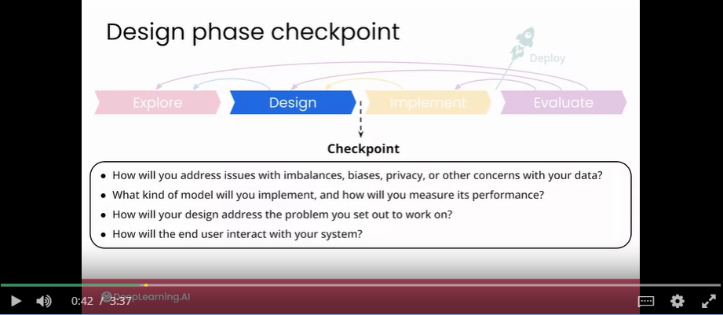
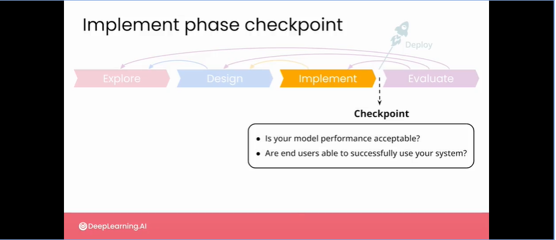

# week content
- Week main task: designing and implementing your air quality mapping product

# First problem
- Missing data is a significant issue for the air pollution sensor network in Bogota
    - 
- Solution idea:
    - Because in many cases, whether a missing values for one pollutant, there are still valid records for other pollutants
    - Some of the different pollutant levels appear to be correlated
    - The pollutant levels seem to depend on the time of day, day of week, and sensor station location.
    - Idea: There might be a role to play for AI in using the rest of the data to make somewhat accurate estimates of these missing values. 
- Simple solutions for filling missing data:
    - take last value: past measurement, same location
    - take nearest station: current measurement, different location
    - use nearest neighbor method with MAE

# Baseline usage
- At first stage, rather than taking a sort of AI first approach, it's always a good idea to spend some time experimenting with the simplest possible solution that you can imagine.
- Reasons to to that:
    - Reason 1: If a simple solution turns out to be good enough to meet your goals, you might want to stop there. Because by choosing a simple route, you might get your solution faster, maybe at a lower cost, and it might be easier to interpret the results.
    - Reason 2: If you move on to implementing a more complex model, then you will need to be able to quantify the relative performance improvements of your model relative to a simple baseline, such as this.

# Design phase: checkpoint
- Question that should be answered in order to move to the next Implement phase:
    - 
    - p1: we are working with public scientific data so there are no major concerns.
        - Keep in mind, however, just the fact that a dataset is publicly available, that doesn't mean that it can do no harm. The application that you are working on is intended to be part of a broader public health initiative regarding air quality in the city of Bogota. You need to be sure that at the very least, your product does no harm by providing wrong or confusing information.
        - For example, if you are able to come up with much more accurate estimates of sudden bursts of pollution, this can be associated with illegal manufacturing or an illegal burn off, or some other criminal activity that could attract surveillance use cases, not just surveillance for pollutants, but surveillance for crime. If this information is then used to prosecute people for crimes or identify criminals, then the community might understandably lose trust in these sensors and there'll be resistance towards trust in the sensor data, or even having future sensors installed.
        - Talk with stakeholders for such cornercase use-cases! Think about potential risk!

# Implement Phase
- Examples of challenges in this phase:
    - How do you deploy your system on a Cloud or hosted server?
    - How will you receive and process the data stream of current tests and measurements?
    - How you monitor for up time?
    - How will you deal with outliers which are different to the error as you've seen before?
    - How you display the user interface on a web or mobile application?

# Implement phase: checkpoint
- 
    - Is your model performance acceptable?
        - Here, MAE was used - having such measurement is much better than not having ANY measurement at all
    - How are users interacting with our system?
        - Do some end user testing to see how things that go in.
        - Are they comfortable with the way that they're interacting with the software?
        - Are they interacting with it in the way that you thought that they would
        - Talk to other stakeholders to learn whether your product is sufficient to serve their needs
