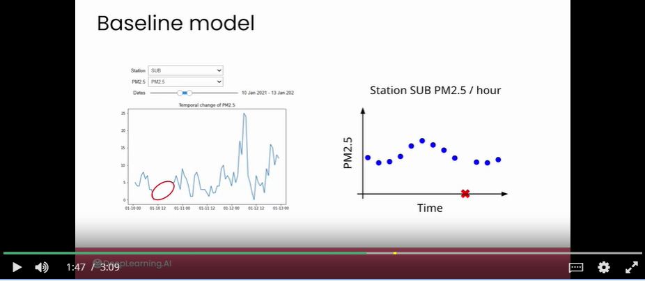

# week content
- Week task 1: designing and implementing your air quality mapping product
- Week task 2: Working through the design phase and the steps you'll focus on will be prototyping your data and modeling strategies addressed in any data privacy and security issues, and designing the end-user experience for your project.

# always take a look at easy solutions first
- At first stage, rather than taking a sort of AI first approach, it's always a good idea to spend some time experimenting with the simplest possible solution that you can imagine.
- Simple solutions for filling missing data:
    - 
    - take last value: past measurement, same location
    - take nearest station: current measurement, different location
    - use nearest neighbor method with MAE
- Reason 1: If a simple solution turns out to be good enough to meet your goals, you might want to stop there.
    - Because by choosing a simple route, you might get your solution faster, maybe at a lower cost, and it might be easier to interpret the results.
- Reason 2: If you move on to implementing a more complex model, then you will need to be able to quantify the relative performance improvements of your model relative to a simple baseline, such as this.
